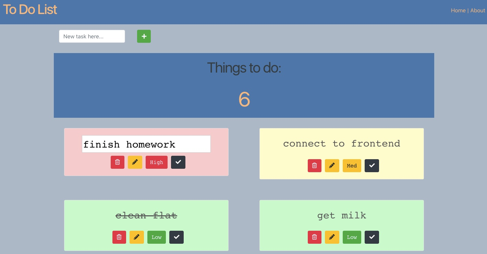

# My Todo List - Frontend

This is the front end of My Todo List application, built throughout the [BBC's Step into Tech course](https://www.youtube.com/watch?v=iH5zl6iQYoo) with [Tech Returners](https://techreturners.com). 

It integrates with a backend, available [here](https://github.com/dorarad17/todo-app-backend).

The hosted version of the application is available here: [https://github.com/whatever-link-here](https://github.com/whatever-link-here).

### Technology Used

This project uses the following technology:

- ReactJS
- JavaScript (ES2015+)
- HTML/CSS
- Bootstrap
- Axios
- ESLint

Key features include adding/deleting tasks, in-line edit of descriptions, ability to label tasks by priority (high, medium, low) and marking tasks as complete. 

It has been designed and built with mobile-first reponsive principles in mind. 

### Running the application locally

[Node.js](https://nodejs.org/en/) must be installed if not already.

Clone the application and install dependencies:

    npm install

To start the application:

    npm start

The application will then be accessible at:

[http://localhost:3000](http://localhost:3000)
